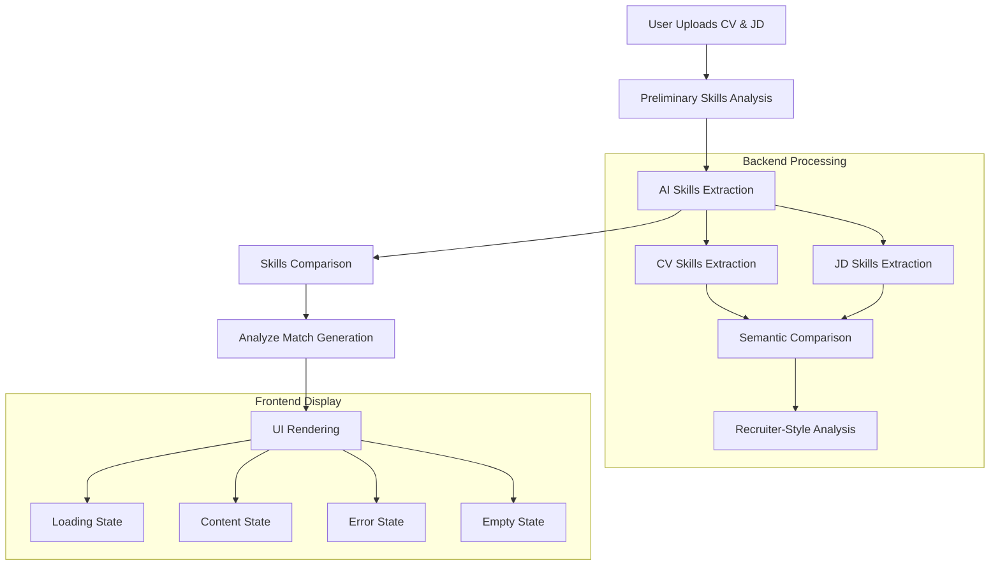

# Analyze Match UI System & AI Prompt Execution Analysis

## Overview
This document provides a comprehensive analysis of the **Analyze Match** feature in the CV Magic app, covering the complete flow from UI display to AI prompt execution and result rendering.

## 1. System Architecture

### 1.1 Flutter Mobile App Structure
The mobile app is located in `cv-magic-app/mobile_app/` and uses a widget-based architecture:

```
mobile_app/
├── lib/
│   ├── widgets/
│   │   ├── analyze_match_widget.dart          # Main UI widget
│   │   ├── test_analyze_match_widget.dart     # Test widget for UI states
│   ├── models/
│   │   ├── skills_analysis_model.dart         # Data models
│   ├── utils/
│   │   ├── text_formatter.dart                # Text formatting utilities
```

### 1.2 Backend API Structure
The backend system handles AI processing and prompt execution:

```
backend/
├── app/
│   ├── routes/
│   │   ├── skills_analysis.py                 # Main API endpoint
│   ├── services/
│   │   ├── skill_extraction/
│   │   │   ├── preextracted_comparator.py     # Skills comparison logic
│   ├── ai/
│   │   ├── ai_service.py                      # AI service management
```

## 2. Data Flow Architecture

### 2.1 Complete Request Flow



### 2.2 Data Models

#### AnalyzeMatchResult Model
```dart
class AnalyzeMatchResult {
  final String rawAnalysis;        // AI-generated analysis content
  final String? companyName;       // Extracted company name
  final String? filePath;          // File path where results saved
  final String? error;             // Error message if any
}
```

#### SkillsAnalysisResult Model
```dart
class SkillsAnalysisResult {
  final SkillsData cvSkills;              // Extracted CV skills
  final SkillsData jdSkills;              // Extracted JD requirements
  final String? cvComprehensiveAnalysis;   // Detailed CV analysis
  final String? jdComprehensiveAnalysis;   // Detailed JD analysis
  final AnalyzeMatchResult? analyzeMatch;  // Recruiter assessment
  // ... other fields
}
```

## 3. UI Widget System

### 3.1 AnalyzeMatchWidget Structure
The main widget (`analyze_match_widget.dart`) handles four states:

#### Loading State
- **Visual**: Orange gradient card with progress indicator
- **Content**: "Generating recruiter-style hiring assessment..."
- **Duration**: Typically 30-60 seconds for AI processing

#### Content State
- **Visual**: Color-coded header based on decision type
- **Decision Types**:
  - 🟢 STRONG PURSUE (Green) - 80%+ probability
  - 🟡 STRATEGIC PURSUE (Orange) - 40-70% probability
  - 🟠 CALCULATED RISK (Deep Orange) - 15-40% probability
  - 🔴 REALISTIC REJECT (Red) - <15% probability

#### Error State
- **Visual**: Red-themed card with error icon
- **Content**: Error message display

#### Empty State
- **Visual**: Grey-themed placeholder
- **Content**: "No analyze match results available"

### 3.2 Text Formatting System
The `AnalyzeMatchFormattedText` widget provides sophisticated formatting:

```dart
class AnalyzeMatchFormattedText extends StatelessWidget {
  // Handles:
  // - Decision indicator formatting (🟢🟡🟠🔴)
  // - Bold text parsing (**)
  // - Section headers
  // - Bullet point formatting
  // - Color-coded text based on content
}
```

**Key Features**:
- **Decision Color Mapping**: Automatic color assignment based on emoji indicators
- **Markdown Support**: Parses `**bold**` text formatting
- **Interactive Text**: SelectableText.rich for copy functionality

## 4. AI Prompt System

### 4.1 Prompt Generation Flow
The analyze match prompt is generated through a centralized system:

```python
# Backend: app/routes/skills_analysis.py
analyze_match_prompt = get_skill_prompt('analyze_match', 
                                       cv_text=cv_content, 
                                       job_text=jd_text)

# AI service execution
analyze_match_response = await ai_service.generate_response(
    prompt=analyze_match_prompt,
    temperature=0.3,
    max_tokens=4000
)
```

### 4.2 AI Service Architecture
The system uses a hybrid AI service approach:

```python
class AIServiceManager:
    # Handles multiple AI providers
    # - DeepSeek (Primary)
    # - OpenAI GPT (Fallback)
    # - Other providers as configured
    
    async def generate_response(self, prompt, temperature, max_tokens):
        # Provider selection logic
        # Error handling and fallback
        # Response formatting
```

### 4.3 Prompt Engineering
The analyze match prompt follows a recruiter-style assessment format:

**Key Sections**:
1. **DECISION**: Color-coded recommendation with probability
2. **MARKET REALITY CHECK**: Practical hiring considerations
3. **INTELLIGENT OBSERVATIONS**: Hidden strengths and connections
4. **REALISTIC ODDS**: Interview probability percentage
5. **STRATEGIC PRIORITIES**: Ranked improvement recommendations
6. **HONEST BOTTOM LINE**: Candid assessment summary

## 5. Skills Analysis Pipeline

### 5.1 Skill Extraction Process
```python
# 1. CV Skills Extraction
cv_structured_prompt = get_skill_prompt('combined_structured', 
                                       text=cv_content, 
                                       document_type="CV")

# 2. JD Requirements Extraction
jd_structured_prompt = get_skill_prompt('combined_structured', 
                                       text=jd_text, 
                                       document_type="Job Description")

# 3. Semantic Comparison
preextracted_output = await execute_skills_semantic_comparison(
    ai_service,
    cv_skills=cv_skills,
    jd_skills=jd_skills,
    temperature=0.3,
    max_tokens=3000
)
```

### 5.2 Skills Comparison Logic
The system uses intelligent semantic matching:

```python
# preextracted_comparator.py
def build_prompt(cv_skills: Dict[str, list], jd_skills: Dict[str, list]):
    # Semantic matching rules:
    # - "Python programming" → "Python" = ✅ match
    # - "Leadership" → "Team leadership" = ✅ match  
    # - "Data analysis" → "Analytical skills" = ✅ match
    
    return formatted_comparison_prompt
```

## 6. File Management System

### 6.1 Results Persistence
All analyze match results are saved to structured files:

```
cv-analysis/
├── {Company_Name}/
│   ├── job_info_YYYYMMDD_HHMMSS.json
│   ├── skills_analysis_YYYYMMDD_HHMMSS.json
│   └── analyze_match_YYYYMMDD_HHMMSS.txt
```

### 6.2 Company Name Extraction
The system automatically detects company names from job descriptions:

```python
# analysis_results_saver.py
def extract_company_name(self, job_text: str) -> str:
    # Pattern matching for company names
    # Fallback to "Unknown_Company"
```

## 7. Error Handling & Resilience

### 7.1 UI Error States
- **Network Errors**: Retry logic with user feedback
- **AI Service Failures**: Graceful degradation
- **Parsing Errors**: Fallback to raw text display

### 7.2 Backend Error Handling
```python
try:
    analyze_match_response = await ai_service.generate_response(...)
    result["analyze_match"] = {
        "raw_analysis": analyze_match_content,
        "company_name": company_name
    }
except Exception as e:
    logger.error(f"❌ [ANALYZE_MATCH] Error: {str(e)}")
    result["analyze_match"] = {
        "error": f"Analyze match failed: {str(e)}",
        "raw_analysis": None
    }
```

## 8. Performance Considerations

### 8.1 Processing Times
- **Skills Extraction**: 10-20 seconds
- **Analyze Match Generation**: 30-60 seconds
- **Total Pipeline**: 60-90 seconds

### 8.2 Optimization Strategies
- **Caching**: Results cached based on CV + JD hash
- **Streaming**: Progressive UI updates during processing
- **Parallel Processing**: Skills extraction runs simultaneously

## 9. Testing & Quality Assurance

### 9.1 Test Widget
The `TestAnalyzeMatchWidget` provides comprehensive testing:

```dart
class TestAnalyzeMatchWidget extends StatelessWidget {
  // Tests all four states:
  // - Loading state with progress
  // - Content state with dummy data
  // - Empty state handling
  // - Error state display
}
```

### 9.2 Debug Logging
Comprehensive logging throughout the pipeline:

```dart
debugPrint('🔍 [ANALYZE_MATCH_WIDGET] Building widget');
debugPrint('   isLoading: ${widget.isLoading}');
debugPrint('   analyzeMatch: ${widget.analyzeMatch != null}');
```

## 10. Integration Points

### 10.1 Mobile App Integration
The analyze match widget integrates with:
- **Main Analysis Flow**: Part of comprehensive skills analysis
- **Results Display**: Displayed alongside other analysis components
- **File Management**: Results saved and retrievable

### 10.2 API Integration
RESTful API endpoints:
- `POST /skills-analysis/preliminary` - Triggers full analysis including analyze match
- Response includes analyze match data in structured format

## 11. Current Architecture Strengths

### 11.1 Modularity
- **Separation of Concerns**: UI, data, and business logic clearly separated
- **Reusable Components**: Text formatters and widgets are reusable
- **Pluggable AI Services**: Easy to switch between AI providers

### 11.2 User Experience
- **Progressive Loading**: Clear loading states with progress indicators
- **Rich Formatting**: Color-coded, formatted text for easy reading
- **Interactive Elements**: Selectable text for copying results

### 11.3 Reliability
- **Error Handling**: Comprehensive error states and fallbacks
- **Data Persistence**: Results saved to files for later retrieval
- **Validation**: Input validation and result verification

## 12. Future Enhancement Opportunities

### 12.1 UI Improvements
- **Real-time Streaming**: Display analysis as it's generated
- **Interactive Elements**: Expandable sections, tooltips
- **Export Options**: PDF/Word export functionality

### 12.2 AI Enhancement
- **Multi-model Comparison**: Compare results from different AI models
- **Custom Prompts**: User-customizable analysis styles
- **Learning System**: Improve prompts based on feedback

### 12.3 Performance Optimization
- **Background Processing**: Pre-process common job types
- **Progressive Enhancement**: Show partial results during processing
- **Caching Strategy**: Intelligent caching of similar analyses

---

This comprehensive analysis shows that the current Analyze Match system is well-architected with clear separation of concerns, robust error handling, and a user-friendly interface. The system successfully integrates AI-powered analysis with a polished mobile UI while maintaining reliability and performance.