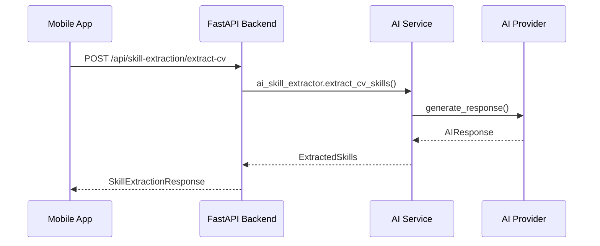

# CV-Magic-App AI Models Implementation Analysis

## Overview

The CV-Magic-App implements a sophisticated AI system for CV analysis and job matching. The system is built with a modular architecture that supports multiple AI providers and models, offering flexibility and scalability.

## Architecture Overview

### 1. Multi-Provider AI System

The application supports three major AI providers:

- **OpenAI** (GPT models)
- **Anthropic** (Claude models)  
- **DeepSeek** (Specialized coding/reasoning models)

### 2. Core Components

#### Backend Components

```
├── AI Service Layer
│   ├── AIServiceManager (Central coordinator)
│   ├── BaseAIProvider (Abstract interface)
│   └── Provider Implementations
│       ├── OpenAIProvider
│       ├── AnthropicProvider
│       └── DeepSeekProvider
├── Configuration Layer
│   ├── AIConfig (Model configurations)
│   └── Environment Management
└── API Layer
    ├── AI Routes (/api/ai/*)
    └── Skill Extraction Routes (/api/skill-extraction/*)
```

#### Frontend Components

```
├── AI Model Service (Flutter)
├── Model Configuration
├── Backend Synchronization
└── User Interface Integration
```

## Detailed Implementation

### Backend AI Implementation

#### 1. AIServiceManager (`backend/app/ai/ai_service.py`)

**Purpose**: Central coordinator for all AI operations

**Key Features**:
- Dynamic provider switching
- Model management across providers
- Unified interface for AI operations
- Cost tracking and token usage monitoring

**Key Methods**:
```python
async def generate_response(prompt, system_prompt, temperature, max_tokens, provider_name)
async def analyze_cv_content(cv_text)
async def compare_cv_with_job(cv_text, job_description)
def switch_provider(provider_name, model_name)
def switch_model(model_name)
```

#### 2. BaseAIProvider (`backend/app/ai/base_provider.py`)

**Purpose**: Abstract interface ensuring consistency across providers

**Key Features**:
- Standardized AIResponse format
- Common provider interface
- Error handling and validation

**AIResponse Structure**:
```python
{
    "content": "AI generated content",
    "model": "model_id", 
    "provider": "provider_name",
    "tokens_used": 1500,
    "cost": 0.023,
    "metadata": {...}
}
```

#### 3. Provider Implementations

**OpenAI Provider**:
- Models: GPT-4o, GPT-4o Mini, GPT-4 Turbo, GPT-3.5 Turbo
- Features: Vision capabilities, high performance
- Cost calculation and token tracking

**Anthropic Provider**:
- Models: Claude 3.5 Sonnet, Claude 3.5 Haiku, Claude 3 Opus
- Features: Advanced reasoning, large context windows
- System prompt support

**DeepSeek Provider**:
- Models: DeepSeek Chat, DeepSeek Coder, DeepSeek Reasoner
- Features: Cost-effective, specialized for coding and reasoning
- Competitive pricing model

#### 4. Configuration Management (`backend/app/ai/ai_config.py`)

**Purpose**: Centralized configuration for all AI models and providers

**Features**:
- Environment variable integration
- Model specifications and pricing
- Default model selection logic
- API key management

**Model Configuration Structure**:
```python
@dataclass
class ModelConfig:
    provider: str
    model: str
    name: str
    description: str
    max_tokens: int
    input_cost_per_1k: float
    output_cost_per_1k: float
```

### Frontend AI Implementation

#### 1. AI Model Service (`mobile_app/lib/services/ai_model_service.dart`)

**Purpose**: Flutter service for AI model management

**Key Features**:
- Model persistence with SharedPreferences
- Backend synchronization
- Real-time model switching
- Authentication integration

**Key Methods**:
```dart
Future<void> changeModel(String modelId)
Future<void> syncAfterAuth()
Map<String, dynamic> getCurrentModelInfo()
List<AIModel> getRecommendedModels()
```

#### 2. Model Configuration (`mobile_app/lib/models/ai_model.dart`)

**Purpose**: Flutter model definitions and metadata

**Features**:
- UI-friendly model information
- Capability categorization
- Performance characteristics
- Visual theming integration

**Model Categories**:
- **Text Processing**: General text analysis
- **Code Generation**: Programming assistance  
- **Analysis**: Deep analytical tasks
- **Vision**: Image processing capabilities
- **Reasoning**: Complex problem solving

## AI Functionality Throughout the Application

### 1. Core AI Operations

#### CV Analysis
```python
async def analyze_cv_content(cv_text: str) -> AIResponse:
    system_prompt = """
    Analyze the provided CV and extract:
    1. Technical skills (programming languages, frameworks, tools)
    2. Soft skills (communication, leadership, etc.)
    3. Domain expertise and keywords
    4. Years of experience (estimate)
    5. Education level and field
    6. Key achievements and projects
    """
```

**Output Format**:
```json
{
    "technical_skills": ["Python", "React", "AWS"],
    "soft_skills": ["Leadership", "Communication"],
    "domain_keywords": ["Machine Learning", "Web Development"],
    "experience_years": 5,
    "education": "Bachelor's in Computer Science",
    "key_achievements": ["Led team of 10", "Increased performance by 40%"],
    "summary": "Senior software engineer with 5 years experience..."
}
```

#### CV-Job Comparison
```python
async def compare_cv_with_job(cv_text: str, job_description: str) -> AIResponse:
    system_prompt = """
    Compare the provided CV with the job description and provide:
    1. Match score (0-100)
    2. Matched skills and qualifications
    3. Missing skills and qualifications
    4. Recommendations for improving the application
    5. Strengths to highlight
    """
```

**Output Format**:
```json
{
    "match_score": 85,
    "matched_skills": ["Python", "React", "Team Leadership"],
    "missing_skills": ["Docker", "Kubernetes"],
    "matched_qualifications": ["5+ years experience", "Bachelor's degree"],
    "missing_qualifications": ["Cloud certification"],
    "recommendations": ["Highlight project management experience"],
    "strengths_to_highlight": ["Strong technical background", "Leadership experience"]
}
```

### 2. Skill Extraction System

The application implements a sophisticated 5-category skill extraction system:

#### Categories:
1. **Technical Skills**: Programming languages, frameworks, tools
2. **Soft Skills**: Communication, leadership, teamwork
3. **Domain Keywords**: Industry-specific terminology
4. **Experience Keywords**: Role levels, responsibilities
5. **Education Keywords**: Degrees, certifications, institutions

#### API Endpoints:
```
POST /api/skill-extraction/extract - General skill extraction
POST /api/skill-extraction/extract-cv - CV-specific extraction
POST /api/skill-extraction/extract-jd - Job description extraction
POST /api/skill-extraction/cv-jd-side-by-side - Comparative analysis
POST /api/skill-extraction/compare - Skill matching analysis
```

### 3. Model Management API

#### Status and Configuration:
```
GET /api/ai/status - Current AI system status
GET /api/ai/providers - Available providers
GET /api/ai/models - All available models
POST /api/ai/switch-provider - Change AI provider
POST /api/ai/switch-model - Change model within provider
```

#### AI Operations:
```
POST /api/ai/chat - General AI chat completion
POST /api/ai/analyze-cv - CV analysis
POST /api/ai/compare-cv-job - CV-job comparison
```

## Model Selection and Optimization

### Recommended Models by Use Case:

#### 1. General CV Analysis:
- **Primary**: GPT-4o Mini (fast, cost-effective)
- **Alternative**: Claude 3.5 Haiku (balanced performance)

#### 2. Complex Job Matching:
- **Primary**: Claude 3.5 Sonnet (superior reasoning)
- **Alternative**: GPT-4o (comprehensive analysis)

#### 3. Code Review/Technical Analysis:
- **Primary**: DeepSeek Coder (specialized for code)
- **Alternative**: GPT-4o (general purpose with code skills)

#### 4. Bulk Processing:
- **Primary**: DeepSeek Chat (very low cost)
- **Alternative**: GPT-4o Mini (good balance)

### Cost Optimization Strategy:

The system implements intelligent cost management:

1. **Model Selection**: Automatic selection based on task complexity
2. **Token Estimation**: Pre-analysis to estimate costs
3. **Caching**: Results caching to avoid duplicate processing
4. **Provider Fallback**: Automatic failover to alternative providers

## Integration Patterns

### 1. Frontend-Backend Communication



### 2. Model Synchronization

The Flutter app automatically synchronizes with the backend AI configuration:

1. **Startup Sync**: Load saved model preference
2. **Authentication Sync**: Sync after user login
3. **Manual Sync**: User-initiated model changes
4. **Status Monitoring**: Periodic backend status checks

### 3. Error Handling and Resilience

- **Provider Fallback**: Automatic switch to alternative providers
- **Rate Limit Handling**: Exponential backoff and retry logic
- **Token Limit Management**: Smart chunking for large documents
- **Graceful Degradation**: Fallback to simpler models when needed

## Performance Characteristics

### Response Times (Typical):
- **CV Analysis**: 2-5 seconds
- **Job Comparison**: 3-7 seconds  
- **Skill Extraction**: 1-3 seconds
- **Model Switching**: <1 second

### Token Usage (Average):
- **CV Analysis**: 1500-3000 tokens
- **Job Comparison**: 2500-5000 tokens
- **Skill Extraction**: 1000-2000 tokens

### Cost Analysis (Per Operation):
- **OpenAI GPT-4o Mini**: $0.0003-0.0018
- **Claude 3.5 Haiku**: $0.0002-0.0025
- **DeepSeek Chat**: $0.0001-0.0006

## Security and Privacy

### 1. API Key Management:
- Environment variable storage
- No hardcoded credentials
- Secure key rotation support

### 2. Data Privacy:
- No persistent storage of AI inputs
- Temporary processing only
- GDPR compliance considerations

### 3. Rate Limiting:
- Provider-specific rate limits
- Graceful handling of quotas
- Usage monitoring and alerts

## Future Enhancements

### 1. Planned Features:
- **Custom Model Training**: Fine-tuning for specific industries
- **Advanced Caching**: Redis-based result caching
- **Streaming Responses**: Real-time AI response streaming
- **A/B Testing**: Model performance comparison

### 2. Scalability Improvements:
- **Load Balancing**: Multiple AI provider instances
- **Batch Processing**: Efficient bulk operations
- **Model Versioning**: Support for model updates
- **Performance Analytics**: Detailed usage metrics

## Conclusion

The CV-Magic-App implements a robust, scalable, and flexible AI system that provides:

- **Multi-Provider Support**: Flexibility to choose optimal models
- **Cost Optimization**: Intelligent model selection and usage tracking
- **User Experience**: Seamless integration with Flutter frontend
- **Scalability**: Architecture ready for enterprise deployment
- **Maintainability**: Clean, modular codebase with comprehensive documentation

This implementation demonstrates best practices in AI integration, providing a solid foundation for advanced CV analysis and job matching capabilities.
